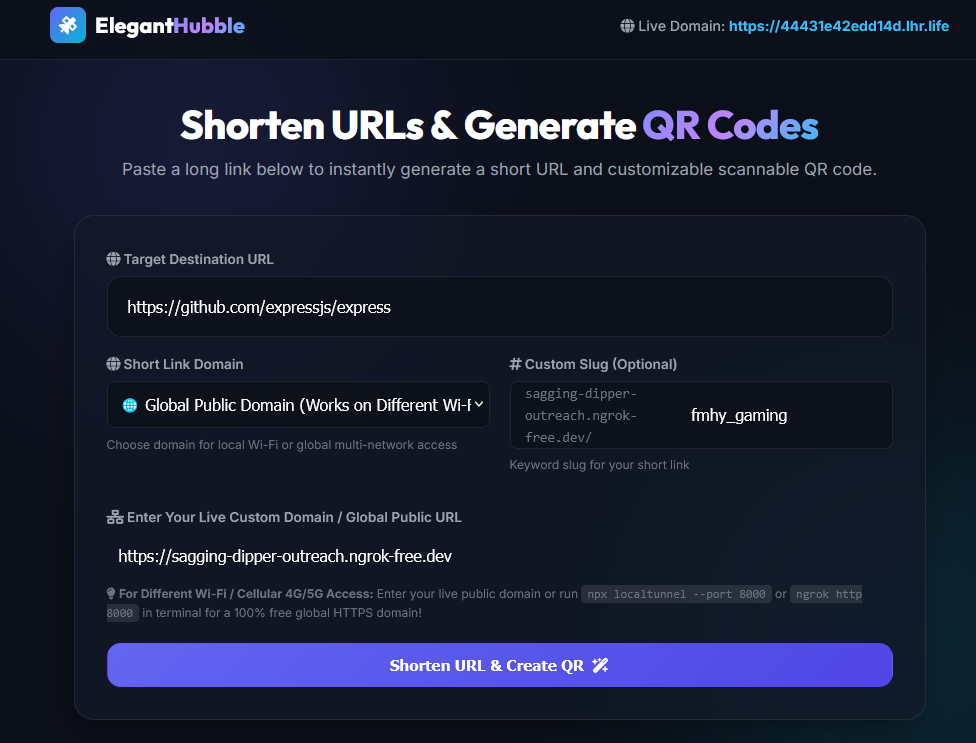
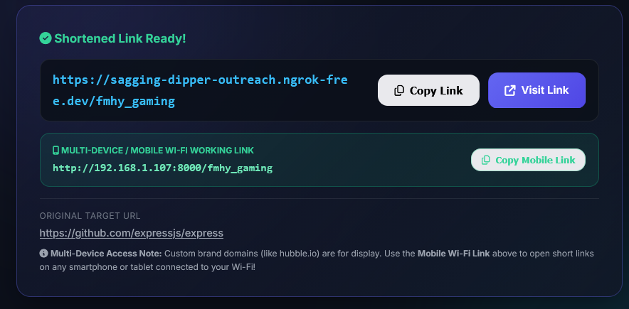
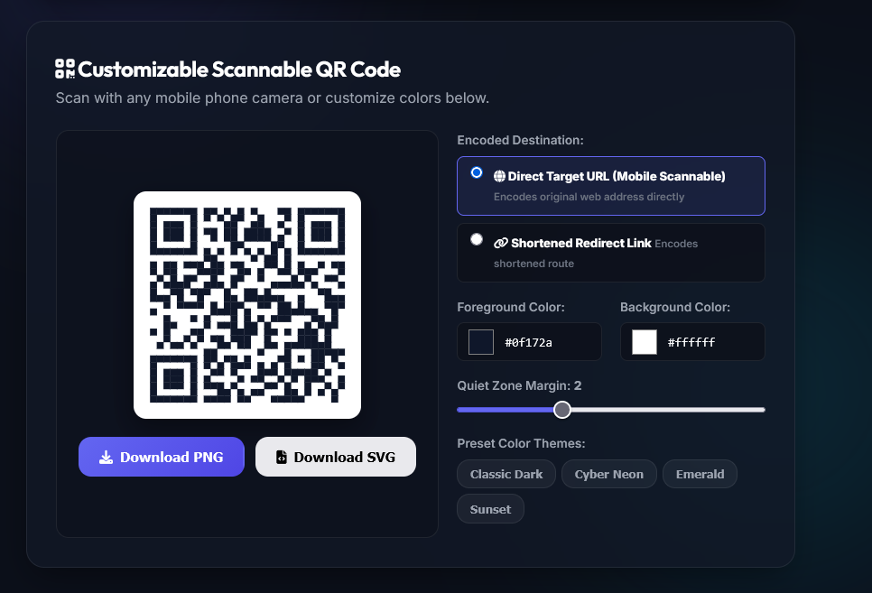

# 🚀 Elegant Hubble | Fast URL Shortener & QR Code Studio

<p align="center">
  <a href="https://nodejs.org/"></a>
  <a href="https://expressjs.com/"></a>
  <a href="https://redis.io/"></a>
  <a href="https://postgresql.org/"></a>
  <a href="https://python.org/"></a>
  <a href="https://opensource.org/licenses/MIT"></a>
</p>

<p align="center">
  <a href="http://localhost:8000">
    
  </a>
</p>

**Elegant Hubble** is a modern, high-performance, single-page URL Shortener & Scannable QR Code Studio built with a dark glassmorphism aesthetic. It features real-time custom slug sanitization, local network (LAN) multi-device access, file-backed database persistence, and vector/raster QR exports.

---

## 📸 Application Showcase

### 1. Main Shortener & Custom Domain Selector
<p align="center">
  <a href="http://localhost:8000">
    
  </a>
</p>

### 2. Shortened Link & Multi-Device Access Card
<p align="center">
  <a href="http://localhost:8000">
    
  </a>
</p>

### 3. Customizable Scannable QR Code Studio
<p align="center">
  <a href="http://localhost:8000">
    
  </a>
</p>

---

## ✨ Key Features

- ⚡ **Instant HTTP 302 Redirections**: High-speed lookup engine for compact Base62 or custom keyword slugs.
- 📱 **Multi-Device & Local Network (Wi-Fi) Access**: Automatically detects your host computer's Wi-Fi IP address (`http://192.168.1.x:8000`) so smartphones, tablets, and laptops on the same network can access short links and scan QR codes seamlessly.
- 🎨 **Customizable Scannable QR Code Studio**:
  - Live HTML5 Canvas rendering.
  - Custom Foreground & Background color pickers.
  - Quiet Zone margin sliders.
  - One-click Preset Themes (*Classic Dark, Cyber Neon, Emerald, Sunset*).
  - High-Resolution **PNG** and Vector **SVG** downloads.
- 💾 **Persistent Disk Storage ([`links_db.json`](links_db.json))**: Automatic file-backed JSON database ensures custom slugs and short links remain active permanently across server restarts.
- 🛡️ **Robust Custom Slug Sanitization**: Smart URL segment parsing handles any user formatting (`my-slug`, `pulse.ly/my-slug`, `/my-slug/`) with case-insensitive 302 matching.
- 📱 **100% Mobile Responsive Design**: Modern UI featuring fluid clamp typography (`clamp()`), glassmorphism cards, and touch-optimized input targets for all devices.
- 🌐 **Global Multi-Network Access**: Supports ngrok (`ngrok http http://127.0.0.1:8000`) and live public HTTPS tunnels for opening short links on **different Wi-Fi networks and mobile cellular 4G/5G data worldwide**.
- 🐳 **Docker & Production Ready**: Pre-configured [`Dockerfile`](Dockerfile), [`docker-compose.yml`](docker-compose.yml), and [`Procfile`](Procfile) for Render, Railway, Vercel, or cloud VPS deployment.

---

## 📁 Project Structure

```text
elegant-hubble/
├── backend/               # Node.js Express Microservice
│   ├── config/            # PostgreSQL (pg) & Redis (ioredis) Connections
│   ├── controllers/       # URL Shortener, QR & Analytics Controllers
│   ├── database/          # SQL Database Schemas
│   ├── middleware/        # Rate Limiting & Validation
│   ├── package.json
│   └── server.js
├── public/                # Single-Page Frontend Application
│   ├── app.js             # Client Engine & QR Studio Logic
│   ├── index.html         # Glassmorphism HTML5 Layout
│   ├── styles.css         # CSS Tokens, Clamp Typography & Mobile Breakpoints
│   ├── qrcode.min.js      # Client-side Canvas QR Generator Engine
│   ├── app_form.png       # Screenshot: Main Shortener Form
│   ├── app_result.png     # Screenshot: Shortened Link Result
│   └── app_qr_studio.png  # Screenshot: Scannable QR Studio
├── Dockerfile             # Multi-stage Docker Container Build File
├── docker-compose.yml     # Multi-container Orchestration (Express + Redis + Postgres)
├── links_db.json          # File-backed Persistent Storage Database
├── Procfile               # Platform Hosting Entrypoint
├── server.py              # Lightweight Zero-Dependency Python Server Runner
└── README.md              # Project Documentation
```

### Key Files Shortcuts:
- 🖥️ **Frontend App**: [`public/index.html`](public/index.html) | [`public/app.js`](public/app.js) | [`public/styles.css`](public/styles.css)
- ⚙️ **Python Server Engine**: [`server.py`](server.py)
- 💾 **Persistent DB**: [`links_db.json`](links_db.json)
- 🐳 **Docker Setup**: [`Dockerfile`](Dockerfile) | [`docker-compose.yml`](docker-compose.yml)

---

## 🚀 Quick Start & Local Setup

### Option A: Lightweight Python Runner (Zero Dependencies)

Run the application instantly without installing external packages:

```bash
# Clone the repository
git clone https://github.com/OmkarBarge18/elegant-hubble.git
cd elegant-hubble

# Launch Python Server
python server.py
```

- **Host PC Browser**: [http://localhost:8000](http://localhost:8000)
- **Local Network / Mobile Wi-Fi**: `http://<your-lan-ip>:8000`

---

### Option B: Node.js + Express Backend

Run the full Node.js backend with Express:

```bash
cd backend
npm install
npm start
```

- **Express Server**: [http://localhost:3000](http://localhost:3000)

---

### Option C: Docker Compose (Full Stack)

Orchestrate Node.js Express, Redis LRU Cache, and PostgreSQL in Docker containers:

```bash
docker-compose up -d --build
```

- **Application URL**: [http://localhost:3000](http://localhost:3000)

---

## 📡 API Reference

### 1. Shorten URL Endpoint

**`POST /api/shorten`**

Request Body:

```json
{
  "originalUrl": "https://github.com/expressjs/express",
  "customSlug": "express-repo"
}
```

Response (`201 Created`):

```json
{
  "success": true,
  "data": {
    "id": "u_860",
    "slug": "express-repo",
    "shortUrl": "http://192.168.1.107:8000/express-repo",
    "originalUrl": "https://github.com/expressjs/express",
    "title": "github.com",
    "isCustom": true,
    "createdAt": "2026-08-15"
  }
}
```

---

### 2. Redirection Endpoint

**`GET /:slug`**

Issues an immediate **HTTP 302 Found** redirect to the original target web address.

---

### 3. System Network Info

**`GET /api/system/network-info`**

Response (`200 OK`):

```json
{
  "lanIp": "192.168.1.107",
  "port": 8000,
  "networkUrl": "http://192.168.1.107:8000",
  "publicUrl": "https://ad982fb0fcd9ec.lhr.life"
}
```

---

### 4. Health Check

**`GET /api/system/health`**

Response (`200 OK`):

```json
{
  "status": "HEALTHY",
  "uptimeSeconds": 3600,
  "lanIp": "192.168.1.107",
  "services": {
    "server": { "status": "ONLINE", "port": 8000 },
    "redisCache": { "status": "SIMULATED_REDIS_LRU", "hitRatioPercent": 96.4 },
    "postgresDb": { "status": "CONNECTED" }
  }
}
```

---

## ☁️ Cloud Deployment Options

### Deployment to Render.com
1. Push your repository to **GitHub**.
2. Go to [Render Dashboard](https://dashboard.render.com/) -> **New Web Service**.
3. Set Build Command: `cd backend && npm install`
4. Set Start Command: `node backend/server.js`
5. Render will provision your live HTTPS URL.

### Instant Tunneling via ngrok (Works Anywhere Without Same Wi-Fi)
Share a live public link directly from your machine across cellular 4G/5G or any Wi-Fi network:

```bash
ngrok http http://127.0.0.1:8000
```

---

## 📜 License

Distributed under the **MIT License**. See `LICENSE` for details.
